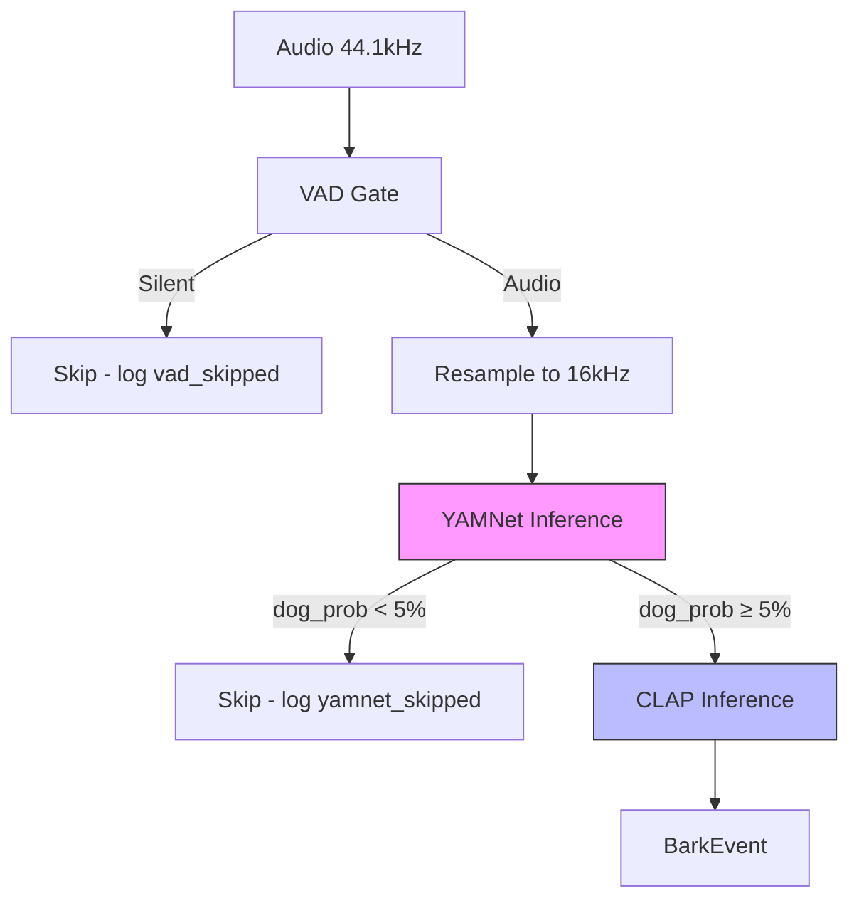

# feat: Two-Stage Bark Detection with YAMNet Pre-Filter

## Overview

Add YAMNet as a fast pre-filter before CLAP to reduce expensive CLAP inference calls by 30-40% while maintaining zero missed barks. YAMNet runs at 16kHz with ~30-50ms latency, filtering out audio that is clearly not dog-related before invoking the heavier CLAP classifier (~150-300ms).

**Pipeline Flow:**
```
Audio (44.1kHz) → VAD Gate → YAMNet Filter → CLAP Classification → BarkEvent
                    ↓              ↓
              Skip silent    Skip non-dog
```

## Problem Statement / Motivation

- CLAP inference is expensive (~150-300ms per call)
- Running CLAP every 500ms on all non-silent audio wastes compute
- Many audio chunks are obviously not dog sounds (music, speech, traffic)
- Need a fast, cheap filter to gate CLAP invocations

## Proposed Solution

Insert YAMNet (Google's lightweight 3.7M param audio classifier) between VAD and CLAP:

1. **YAMNet** predicts 521 AudioSet classes including Dog (69), Bark (70), Howl (72), etc.
2. If dog-related class probability < 5%, skip CLAP entirely
3. If ≥ 5%, proceed to CLAP for final classification
4. Fallback to CLAP-only mode if YAMNet fails to load

## Technical Approach

### Architecture



### Key Design Decisions

| Decision | Choice | Rationale |
|----------|--------|-----------|
| Pipeline placement | After VAD, before CLAP | VAD is cheap (RMS), filters ~50% silently |
| Threshold | 5% dog probability | Low threshold to avoid false negatives |
| Dog classes | 69, 70 (Dog, Bark) | Primary targets; optionally include 71-75 |
| Fallback mode | CLAP-only on YAMNet failure | Graceful degradation |
| Model source | TensorFlow Hub | Well-documented, proven |
| Resampling | torchaudio.functional.resample | Matches existing codebase patterns |

### Error Handling Strategy

| Scenario | Action |
|----------|--------|
| YAMNet fails to load at startup | Log warning, continue with CLAP-only |
| YAMNet runtime inference error | Fall through to CLAP for that chunk, log error |
| Resampling failure | Skip chunk entirely, log error |
| TensorFlow Hub unreachable | Use cached model if available, else fallback mode |

## Implementation Phases

### Phase 1: YAMNet Module

**Create `src/woofalytics/detection/yamnet.py`**

```python
# src/woofalytics/detection/yamnet.py
"""YAMNet pre-filter for bark detection pipeline."""

from dataclasses import dataclass, field
import numpy as np
import structlog

logger = structlog.get_logger(__name__)

DOG_CLASS = 69   # "Dog"
BARK_CLASS = 70  # "Bark"

@dataclass
class YAMNetConfig:
    threshold: float = 0.05
    dog_classes: list[int] = field(default_factory=lambda: [69, 70])
    device: str = "cpu"

class YAMNetGate:
    """Fast pre-filter using YAMNet for bark detection."""

    def __init__(self, config: YAMNetConfig | None = None) -> None:
        self.config = config or YAMNetConfig()
        self._model = None
        self._loaded = False
        self._skipped_count = 0
        self._passed_count = 0

    def load(self) -> bool:
        """Load YAMNet from TensorFlow Hub."""
        try:
            import tensorflow_hub as hub
            self._model = hub.load("https://tfhub.dev/google/yamnet/1")
            self._loaded = True
            logger.info("yamnet_loaded", threshold=self.config.threshold)
            return True
        except Exception as e:
            logger.warning("yamnet_load_failed", error=str(e))
            return False

    def is_dog_sound(self, audio: np.ndarray, sample_rate: int = 44100) -> bool:
        """Check if audio likely contains dog sounds."""
        if not self._loaded:
            return True  # Fallback: pass to CLAP

        try:
            audio = self._preprocess(audio, sample_rate)
            scores, _, _ = self._model(audio)
            dog_prob = self._get_dog_probability(scores.numpy())

            is_dog = dog_prob >= self.config.threshold
            if is_dog:
                self._passed_count += 1
            else:
                self._skipped_count += 1
            return is_dog
        except Exception as e:
            logger.warning("yamnet_inference_error", error=str(e))
            return True  # Fallback: pass to CLAP

    def _preprocess(self, audio: np.ndarray, sample_rate: int) -> np.ndarray:
        """Resample to 16kHz mono float32."""
        import torchaudio.functional as F
        import torch

        if audio.ndim == 2:
            audio = audio.mean(axis=0)
        if audio.dtype == np.int16:
            audio = audio.astype(np.float32) / 32768.0

        if sample_rate != 16000:
            tensor = torch.from_numpy(audio).unsqueeze(0)
            audio = F.resample(tensor, sample_rate, 16000).squeeze(0).numpy()
        return audio

    def _get_dog_probability(self, scores: np.ndarray) -> float:
        """Extract max dog-related probability from YAMNet scores."""
        mean_scores = scores.mean(axis=0)
        dog_probs = [mean_scores[i] for i in self.config.dog_classes]
        return max(dog_probs)

    @property
    def stats(self) -> dict:
        total = self._skipped_count + self._passed_count
        return {
            "skipped": self._skipped_count,
            "passed": self._passed_count,
            "skip_rate": self._skipped_count / total if total > 0 else 0.0,
        }
```

### Phase 2: Configuration

**Modify `src/woofalytics/config.py`** (add after line ~106):

```python
# YAMNet pre-filter settings
yamnet_enabled: bool = Field(
    default=True,
    description="Enable YAMNet pre-filter to skip CLAP on non-dog audio.",
)
yamnet_threshold: float = Field(
    default=0.05,
    ge=0.0,
    le=1.0,
    description="YAMNet dog probability threshold for running CLAP.",
)
yamnet_fallback_to_clap: bool = Field(
    default=True,
    description="Fall back to CLAP-only if YAMNet fails to load.",
)
```

### Phase 3: Metrics

**Modify `src/woofalytics/observability/metrics.py`**:

```python
# Add counter (around line 107)
self._yamnet_skipped_total = prom.Counter(
    "woofalytics_yamnet_skipped_total",
    "Inferences skipped by YAMNet pre-filter",
)

# Add histogram for inference time
self._yamnet_latency = prom.Histogram(
    "woofalytics_yamnet_inference_seconds",
    "YAMNet inference latency",
    buckets=[0.01, 0.025, 0.05, 0.1, 0.25],
)

# Add accessor methods
def inc_yamnet_skipped(self) -> None:
    if self._yamnet_skipped_total:
        self._yamnet_skipped_total.inc()

def observe_yamnet_latency(self, latency: float) -> None:
    if self._yamnet_latency:
        self._yamnet_latency.observe(latency)
```

### Phase 4: BarkDetector Integration

**Modify `src/woofalytics/detection/model.py`**:

```python
# Add import (after line 26)
from woofalytics.detection.yamnet import YAMNetConfig, YAMNetGate

# Add instance variable to BarkDetector (after line 75)
_yamnet_gate: YAMNetGate | None = field(default=None, init=False)
_yamnet_skipped_count: int = field(default=0, init=False)

# In _load_clap_model() method, add after CLAP initialization:
if self.settings.model.yamnet_enabled:
    yamnet_config = YAMNetConfig(
        threshold=self.settings.model.yamnet_threshold,
    )
    self._yamnet_gate = YAMNetGate(yamnet_config)
    if not self._yamnet_gate.load():
        if not self.settings.model.yamnet_fallback_to_clap:
            raise RuntimeError("YAMNet failed to load")
        self._yamnet_gate = None
        logger.warning("yamnet_fallback_to_clap_only")

# In _run_clap_inference(), after VAD check (around line 270):
if self._yamnet_gate:
    import time
    yamnet_start = time.perf_counter()
    try:
        is_dog = self._yamnet_gate.is_dog_sound(
            audio_array,
            sample_rate=self.settings.audio.sample_rate
        )
    except Exception as e:
        logger.warning("yamnet_error", error=str(e))
        is_dog = True  # Fallback to CLAP
    finally:
        metrics.observe_yamnet_latency(time.perf_counter() - yamnet_start)

    if not is_dog:
        self._yamnet_skipped_count += 1
        metrics.inc_yamnet_skipped()
        if self._yamnet_skipped_count % 20 == 0:
            logger.debug("yamnet_filtering", stats=self._yamnet_gate.stats)
        return
```

### Phase 5: Dependencies

**Modify `pyproject.toml`**:

```toml
dependencies = [
    # ... existing deps ...
    "tensorflow>=2.15",
    "tensorflow-hub>=0.16",
]
```

### Phase 6: Exports

**Modify `src/woofalytics/detection/__init__.py`**:

```python
from woofalytics.detection.yamnet import YAMNetGate, YAMNetConfig

__all__ = [
    # ... existing exports ...
    "YAMNetGate",
    "YAMNetConfig",
]
```

## Acceptance Criteria

### Functional Requirements

- [ ] YAMNet loads successfully from TensorFlow Hub
- [ ] Audio is correctly resampled from 44.1kHz to 16kHz
- [ ] Dog probability threshold (5%) is configurable
- [ ] YAMNet skips chunks with <5% dog probability
- [ ] CLAP receives chunks with ≥5% dog probability
- [ ] Fallback to CLAP-only works when YAMNet fails
- [ ] All existing bark detections still work (no regression)

### Non-Functional Requirements

- [ ] YAMNet inference < 50ms (95th percentile)
- [ ] Memory increase < 500MB for YAMNet model
- [ ] CLAP calls reduced by 30-40% on typical audio
- [ ] Zero increase in false negative rate

### Quality Gates

- [ ] Unit tests for YAMNetGate class
- [ ] Integration test for full pipeline with YAMNet
- [ ] Metrics emitted for yamnet_skipped_total
- [ ] Logging at appropriate levels (DEBUG for skips, WARN for errors)

## Success Metrics

| Metric | Target | Measurement |
|--------|--------|-------------|
| CLAP call reduction | 30-40% | `yamnet_skipped / (yamnet_skipped + clap_inferences)` |
| YAMNet latency | < 50ms p95 | `yamnet_inference_seconds` histogram |
| False negative rate | 0% increase | Manual validation with known bark samples |
| Memory usage | < 2.5GB total | Process memory monitoring |

## Dependencies & Prerequisites

- TensorFlow 2.15+ and TensorFlow Hub installed
- Network access to TensorFlow Hub at startup (or cached model)
- Existing VAD gate and CLAP detector functional

## Risk Analysis & Mitigation

| Risk | Probability | Impact | Mitigation |
|------|-------------|--------|------------|
| TensorFlow Hub unavailable | Low | Medium | Cache model locally, fallback mode |
| YAMNet accuracy degradation | Low | High | Low 5% threshold, monitoring |
| Memory pressure | Medium | Medium | Lazy loading, GPU/CPU selection |
| Latency exceeds target | Low | Medium | CPU-only mode, batch processing |

## References & Research

### Internal References

- VAD gate pattern: `src/woofalytics/detection/vad.py:29-171`
- CLAP detector pattern: `src/woofalytics/detection/clap.py:20-515`
- Config pattern: `src/woofalytics/config.py:67-135`
- Metrics pattern: `src/woofalytics/observability/metrics.py:57-144`

### External References

- [TensorFlow Hub YAMNet](https://tfhub.dev/google/yamnet/1)
- [YAMNet Tutorial](https://www.tensorflow.org/hub/tutorials/yamnet)
- [AudioSet Ontology](https://research.google.com/audioset/ontology/index.html)
- [YAMNet Class Map CSV](https://github.com/tensorflow/models/blob/master/research/audioset/yamnet/yamnet_class_map.csv)

### Related Work

- Beads issue: `woofalytics-v2-4xn` (Evaluate CLAP alternatives)
